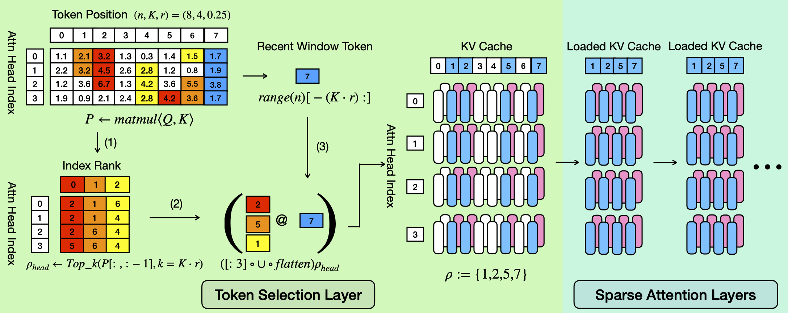
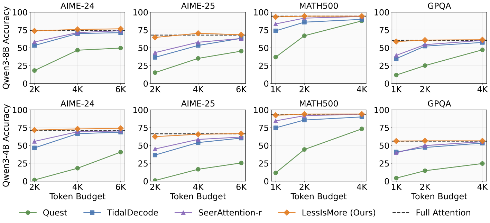
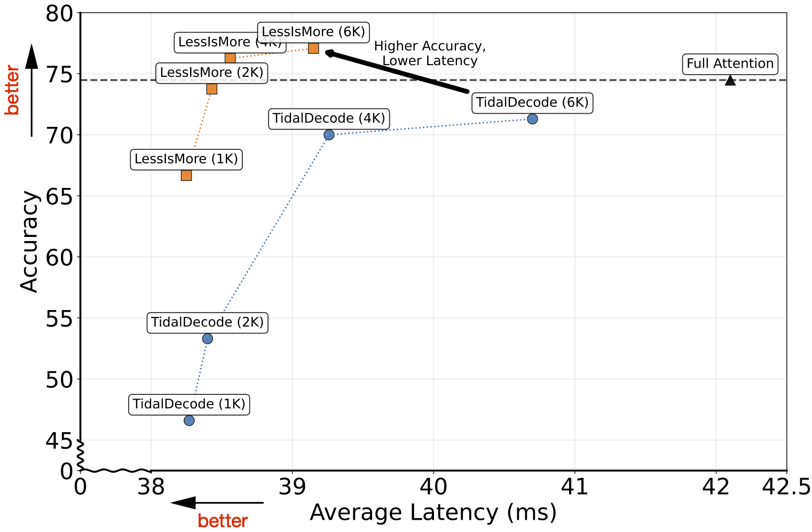
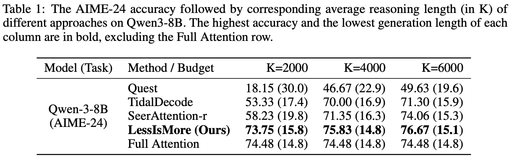

# Less Is More: Training-Free Sparse Attention with Global Locality for Efficient Reasoning
[[paper]()] 
## TL;DR
**LessIsMore** is a novel sparse attention mechanism that dramatically improves the efficiency of large reasoning models without sacrificing accuracy. The key insight is that existing sparse attention methods fail on reasoning tasks because they make localized token selection decisions for each attention head separately, leading to accumulated errors over long reasoning sequences. Instead, LessIsMore leverages two key observations: (1) attention heads in reasoning tasks show significant overlap in which tokens they find important (spatial locality), and (2) recently generated tokens consistently receive high attention across multiple future steps (recency locality). 

By globally aggregating token selections across all attention heads and reserving a stable portion of the budget for recent tokens, LessIsMore achieves lossless accuracy on challenging reasoning benchmarks like AIME-24 while using up to 87.5% fewer tokens and delivering **1.1×** average decoding speedup. Unlike other sparse attention methods that extend generation length due to selection errors, LessIsMore achieves **1.13x** end-to-end generation speedup without extending generation lengths, making it a practical solution for deploying large reasoning models with significantly reduced computational overhead.


*Figure 1: The selection process of LessIsMore is three-fold: (1) under token budget $K=4, r=0.25$, compute attention score matrix $W$ and extract the top-k ($k=K*(1-r)$, $r$ is the ratio of the most recent tokens that will be, by default, reserved as sliding window) token indices for each attention head as $\rho_{head}$; (2) flatten and union the selected indices for all heads, keeping the first k indices; (3) concatenate them with the most recent tokens, resulting in final token set $\rho$. The sparse attention layers only load the tensors of tokens in $\rho$ from KV cache for all attention heads until the next selection layer or the end of the decoding step.*

### Accuracy


*Figure 2: Reasoning accuracy results of LessIsMore(ours), Quest, TidalDecode, SeerAttention-r, and Full Attention across for multiple main-stream reasoning tasks. Across all evaluated tasks, LessIsMore consistently achievs the lossless accuracy with small token budgets (1K or 2K), always outperforming all other baselines.*

### Latency


*Figure 3: Efficiency-accuracy tradeoff comparison on AIME-24 using GQA-based LLama-3.1-8B. Each point represents the end-to-end average per-token decoding latency across the corresponding average generation length. LessIsMore (orange squares) consistently achieves higher accuracy than TidalDecode (blue circles) while maintaining lower latency across all token budgets (1K, 2K, 4K, 6K). The closer to the top-left corner, the better the method performs. Full Attention baseline (triangle) provides the accuracy upper bound but with higher computational cost.*

### Generation of LessIsMore


*Figure 4: The AIME-24 accuracy followed by corresponding average reasoning length (in K) of different approaches on Qwen3-8B. The highest accuracy and the lowest generation length of each column are in bold, excluding the Full Attention row.*


## Installation
1. Clone the submodules
```
git clone https://github.com/DerrickYLJ/LessIsMore.git
git submodule update --init --recursive
```
2. Install dependency libraries
```
conda create -yn lessismore python=3.10
conda activate lessismore
pip install -e . && pip install flash-attn==2.3.0 --no-build-isolation
python setup.py develop

# Install CMake (with version >= 3.26.4)
conda install cmake

# build libraft
cd kernels/3rdparty/raft
./build.sh libraft
```
3. Build end-to-end operators with PyBind
```
# This will automatically build and link the operators
cd tidal/ops
bash setup.sh
```

## Performance Evaluation
Run reasoning tasks by submitting a slurm job:
```
sbatch experiment/reasoning/eun_eval_slurm.sh
```


## Efficiency Evaluation
Kernels and end-to-end effiency are evaluated on A5000 GPU with CUDA version of 12.2.

### End-to-end Efficiency

To reproduce the end-to-end efficiency results, please execute:
```
cd scripts
bash bench_efficiency_e2e.sh
```
## Citation
```
@misc{yang2025moretrainingfreesparseattention,
      title={Less Is More: Training-Free Sparse Attention with Global Locality for Efficient Reasoning}, 
      author={Lijie Yang and Zhihao Zhang and Arti Jain and Shijie Cao and Baihong Yuan and Yiwei Chen and Zhihao Jia and Ravi Netravali},
      year={2025},
      eprint={2508.07101},
      archivePrefix={arXiv},
      primaryClass={cs.CL},
      url={https://arxiv.org/abs/2508.07101}, 
}
```

## Related Projects
**LessIsMore** adopts the code snippets from [TidalDecode](https://github.com/DerrickYLJ/TidalDecode) and [Quest](https://github.com/mit-han-lab/Quest). It uses the script from [LIMO](https://github.com/GAIR-NLP/LIMO) and [SGLang](https://github.com/sgl-project/sglang) for reasoning evaluation. Ours kernels and end-to-end system are implemented based on [FlashInfer](https://github.com/flashinfer-ai/flashinfer). Thanks for all amazing works from the community!

